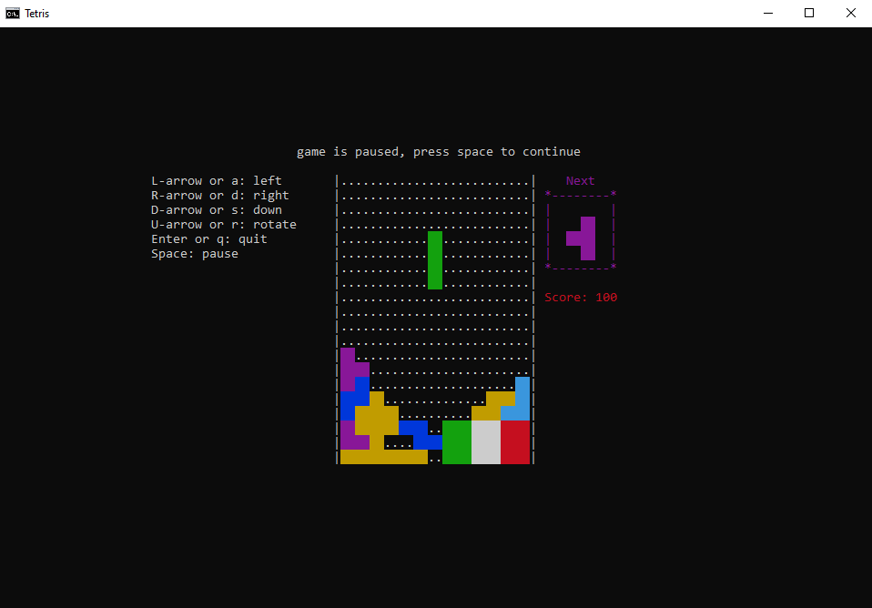
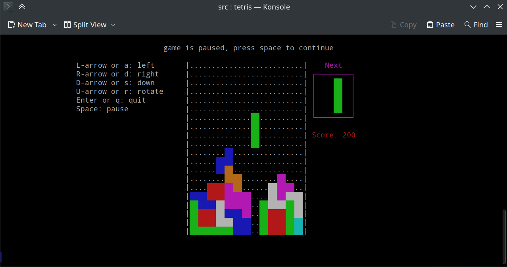

# A simple console tetris for linux and windows

## Description

Tetris is a puzzle video game created in 1985 by Alexey Pajitnov, a Soviet software engineer.

## Build

### Building on linux

1. Take the complied program in the project's build directory

2. Compile with gcc (or any other compiler)

```bash
gcc -Wall -std=gnu89 -pedantic -O2 main.c tetris.c -o tetris
```

3. Build the project:

```bash
make RELEASE=1
```

### Building on Windows

1. Take the complied program in the project's build directory

2. compile with cl (MSVC) or MinGW.

```bash
cl /nologo /W3 /GS /GL /O2 /sdl /Oi /D FOR_WINDOWS main.c tetris.c /Fetetris.exe
```

## Screenshots

### Windows version



### Linux version


